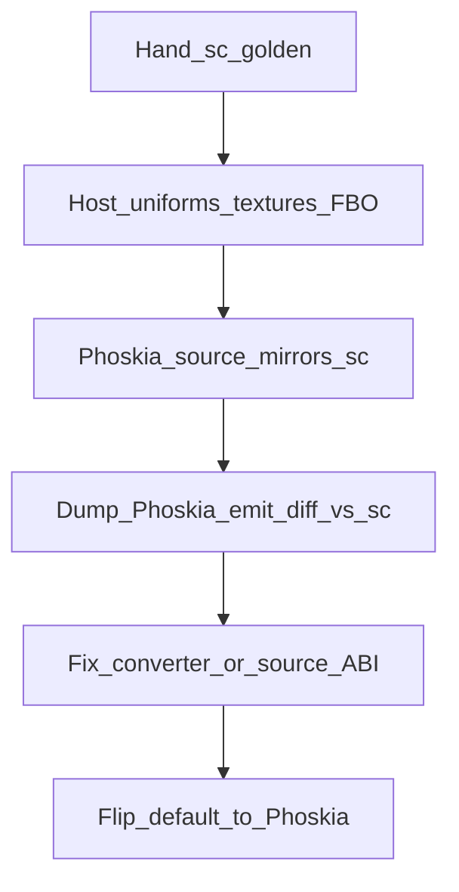

# Pass 落地经验：从 Shadow Pass 抽出的清单

> 目的：把 AYEditor 阴影 Pass 从「能编过」到「和已验证 hand `.sc` 表现一致」过程中踩过的坑，收成**可复用检查表**，指导后续 Transparent / PostProcess 扩展、新 lighting pass、延迟等。  
> 状态：Editor Play 阴影从表现上已基本通过（2026-07-22，stamp `v13-phase7-vec4-abi`）。  
> 配套使用说明仍见 [`shadow-pass.md`](shadow-pass.md)。

---

## 1. 总原则

1. **先有一条 hand-authored bgfx `.sc` 金标路径**，再让 Phoskia→sc 对齐它；不要一上来就拿 Phoskia 当唯一真相。
2. **「编译成功 ≠ 数值正确」**。Phoskia 前端过语义分析、shaderc 出 bin，仍可能因类型推断 / uniform ABI / varying 语义 / FBO 生命周期把画面算坏。
3. **A/B 必须可一键切换**：同一场景、同一 host 上传，只换 shader 来源（Phoskia vs `.sc`）。环境变量比改代码稳。
4. **每个 Pass 的「深度 / 颜色 / 矩阵」契约写进 header + 单测**，CPU 侧镜像（如 `ShadowDepthCodec`）与 GPU 同公式。
5. **改 shader 必 bump cache key / pipeline stamp**，否则磁盘缓存或 `acquire` 指针比较会继续跑旧程序。

---

## 2. 推荐落地顺序（任意新 Pass）

| 阶段 | 做什么 | 完成标准 |
|------|--------|----------|
| A. Hand `.sc` | 手写 vs/fs/varying，走 `acquireFromBgfxSc` / `createMaterialFromBgfxSc` | Editor 画面达标 |
| B. Host 契约 | 统一上传名、stage、矩阵乘法顺序、FBO view 归属 | stderr 探针与截图一致 |
| C. Phoskia 镜像 | 把 `.sc` 算法翻成 Phoskia（无 if/for 则展开） | `compileToProgram` + emit dump 算法同构 |
| D. Emit 对齐 | 对 dump 的 `.sc` 与 hand 做 diff（尤其 uniform / mul / swizzle） | 关键行一致或可解释 |
| E. 默认切换 | 默认 Phoskia，`.sc` 留 env fallback | 裸跑与 `AY_*_USE_SC=1` 观感一致 |

阴影最终采用：**默认 Phoskia**；`AY_SHADOW_USE_SC=1`（或旧 `AY_SHADOW_USE_PHOSKIA=0`）回退 hand `.sc`。

---

## 3. Phoskia ↔ bgfx：必须牢记的边界

### 3.1 Uniform ABI（最高频黑屏源）

| 事实 | 含义 |
|------|------|
| bgfx `createUniform` 对 `float`/`vec2`/`vec3`/`vec4` **一律 Vec4 slot** | CPU 必须按 16 字节上传（host 已有 `trySetUniformVec3` 等 pad） |
| Phoskia **语法**允许窄类型 | 不等于发出的 `.sc` / HLSL CB 布局安全 |
| 发出 `uniform vec3 lightDir` + host 写 Vec4 | 在 D3D 上易出现 lightColor≈0 → **全黑、只剩个别面有色** |
| 发出 `uniform float x = 0.003`（带 GLSL 初值） | 与 bgfx `setUniform` 路径冲突；converter **已改为不 emit 初值** |

**后续 Pass 约定（bgfx 目标）：**

- 灯光、bias、开关、颜色：Phoskia 里写成 **`uniform`/`property` vec4**，着色器用 `.xyz` / `.x`。
- 不要把多个无关标量「手工塞进一个 vec4」除非要做带宽优化；**每个名字仍是独立 Vec4 slot**，host 按名 pad 上传即可。
- Emit 验收：dump 里应是 `uniform vec4 …;`，**没有** `= …` 初值。

### 3.2 矩阵乘法

- Phoskia 源可写 `M * v`；converter 必须对 mat×vec / mat×mat 发成 **`mul(M, v)`**（已做）。
- Light view-proj：**CPU 也要 `P×V` 与 `setViewTransform` 同序**（阴影曾因 LVP 反了整图错位）。

### 3.3 Varying 语义

- `out worldPos : position` 会得到名 `v_position`，但 **varying 语义会被分到 `TEXCOORDn`**（避免与 clip POSITION 冲突）——这是有意设计。
- Hand `.sc` 习惯用 `v_worldpos : TEXCOORD1`。名字可以不同，**语义槽不能撞**；用 `VaryingSemanticAssigner` 的规则，不要手写重复 TEXCOORD。

### 3.4 控制流

- BGFXConverter **不 emit if/for**；PCF / 分支必须展开成 `step`/`mix`/`max`。
- 新 Pass 若需要循环滤波，要么展开，要么留在 hand `.sc`，要么先扩展 converter。

### 3.5 Include

- Phoskia emit 用 `#include "common.sh"`（解析到 bgfx `common.sh` → `bgfx_shader.sh`）。
- Hand `.sc` 可用 `#include <bgfx_shader.sh>`。二者都要保证 `ShaderPoolSetup` 的 include dirs 非空。
- **不要指望**自动 include `examples/common/shaderlib.sh`（`packFloatToRgba` 等）。要用则：内置展开（converter intrinsic）或手写进源码。

### 3.6 深度编码（阴影特例，其它 Pass 类比）

| 方案 | 与 clear=`0xffffffff` + `step(0.999, o)` |
|------|----------------------------------------|
| R 通道复刻 `vec4(nd,nd,nd,1)` + `sample().x` | **已验证，当前生产** |
| `packFloatToRgba` / unpack | `pack(≈1)→≈0`，与「clear≈1 表示无遮挡」冲突；**未开生产** |

其它 Pass 若引入「打包到 RGBA8」：先改 clear / cleared 启发式，再成对改写双方；CPU codec 与 GLSL 必须同一套（含 `res.xxyz` 并行减位）。

---

## 4. 类型推断与 Builtin（Phoskia 特有）

| 坑 | 症状 | 修法 |
|----|------|------|
| 同 arity 重载只取第一个（曾：`mix(F,F,F)` 盖过 `mix(V3,V3,F)`） | emit 出 `float lit = mix(vec3,…)` / 光照崩 | `getOverloads` + 按实参类型打分（已修） |
| float property 未进 type env | `mix`/`step` 被推成 vec3 | 注册 float/int property |
| 缺 `mix(float,…)` | Dynamic → 错前缀类型 | 补 builtin，且必须与 vec 重载共存 |
| 缺 pack/unpack 等 shaderlib 符号 | 编译失败或静默 Dynamic | converter 内联，或手写算术 |

**后续 Pass：** 每加一个 GLSL 重载族（`mix`/`min`/`clamp`/…），单测要覆盖 **同 arity 不同参数类型**；emit dump 断言返回类型前缀。

---

## 5. Host / Pipeline 契约

### 5.1 View 与 FBO

- 同一 view 上绑 FBO 后，不要在后续 pass 误 `setViewFrameBuffer(INVALID)` 拆掉仍在用的附件。
- Shadow：caster / resolve / FO 用**不同 view id**；resolve 失败不能假装 sampleReady。
- 改 `bgfx::reset`（含 MSAA）会丢附件：尺寸或 MSAA 变化时要 **销毁并重建** pass 私有 FBO（阴影已按此处理）。

### 5.2 材质实例

- `createMaterialFromBgfxSc` / `createMaterialFromFile`：**每实例独立**，避免 cube/ground 共享同一 GpuMaterial 导致颜色串台。
- Editor 启动应 **覆盖写入** 缓存目录里的 `.phoskia`，避免旧文件掩盖 header 内联源。

### 5.3 资源名与 stage

- Receiver：`albedoMap` stage 0、`shadowMap` stage 1（与 FO 绑定顺序一致）。
- 名字拼错 → binding invalid → 静默跳过上传 → 又是「黑/全亮」类症状。stderr 打一次 path（Phoskia vs sc）很值。

### 5.4 Caster / Producer 私有状态

- Shadow 铁律：caster 程序与 map 句柄在 `ShadowPass` 私有；消费者只通过 `PassExecContext::shadowPass` 取「可采样句柄 + LVP」。
- 新 Pass 若生产中间 RT：同样 **生产者持有、上下文只读暴露**，避免 FO 直接摸 bgfx handle。

---

## 6. 调试手法（可直接抄）

1. **双路径 A/B**  
   - 金标：`$env:AY_SHADOW_USE_SC="1"`  
   - 待测：去掉该变量（默认 Phoskia）  
   PowerShell 不要用 cmd 的 `SET`（对子进程无效）。

2. **Emit dump**  
   - `CompileOptions.keepSources + dumpIntermediate`  
   - 或跑 `Test_ShadowPhoskiaEmit`  
   - Diff：`uniform` 声明、`mul(`、`.x`/`.xyz`、有无 `= 初值`、有无错误 `float lit = mix`。

3. **分层看图**  
   - 仅 caster 坏：map 全 clear → 无影或全 lit。  
   - 仅 receiver 坏：有几何无正确影 / 全黑。  
   - ABI 坏：地面纯黑、仅一顶面有色（light 未进着色器）。  
   - 矩阵坏：影错位或飞出 frustum（白框/轮廓伪影）。

4. **诊断开关**（阴影已有，新 Pass 建议同级）  
   - `AY_SHADOW_LOG` / `AY_SHADOW_DEBUG` / `AY_SHADOW_CASTER_SOLID`  
   - stamp 打在 stderr：`[ShadowPass] build=…`

5. **单测钉子**  
   - 源契约：字符串断言 `lightDir.xyz`、`shadowBias.x`、9 tap 等。  
   - Emit 契约：禁止错误类型前缀、禁止 property 初值。  
   - CPU codec round-trip（若有打包）。  
   - stamp / cache key 字面量。

---

## 7. 阴影 Pass 问题→结论速查

| 现象 | 根因（摘要） | 结论 |
|------|----------------|------|
| 几乎全黑，一块面有色 | `vec3`/`float` emit vs Vec4 上传 | bgfx 目标用 vec4 + swizzle；禁 property 初值 |
| 有影但偏、飞 | LVP 不是 P×V，或 UV 未透视除 / Y 翻转 | 与 hand `.sc` 逐行对齐 |
| 关 MSAA「像坏了」 | 曾与 Phoskia 错路径耦合；或 reset 丢 FBO | MSAA 变更重建资源；别误判 |
| Phoskia 开 pack 后崩 | pack(1)≠clear 白的语义 | 生产保持 R8；pack 另开 clear 契约 |
| `mix` 把 lit 推成 float | 同 arity 重载选错 | 按参数类型决议 |
| `.sc` 好 Phoskia 坏 | 默认曾强制 sc；后默认 Phoskia 但 ABI 未齐 | 先齐 emit，再切默认 |
| 共享材质变灰 | 实例缓存串用 | 每 draw 独立 material handle |

---

## 8. 新 Pass 开干前的复制清单

复制下面一节到新 Pass 的 PR / `docs/<pass>.md`：

- [ ] Hand `.sc` 金标在 Editor 达标  
- [ ] Host：uniform 名、stage、矩阵序、view/FBO 生命周期有注释 + 日志  
- [ ] Phoskia 源与 `.sc` 算法同构；控制流已展开  
- [ ] **所有进入 bgfx 的标量/向量 uniform 在 Phoskia 中为 vec4 + swizzle**（或 converter 已强制）  
- [ ] Emit dump 无 `uniform T x = …` 初值；灯光相关为 `uniform vec4`  
- [ ] `mul(` 用于一切 mat×vec  
- [ ] cache key + pipeline stamp 已 bump  
- [ ] Env：默认新路径，金标 `.sc` 可强制回退  
- [ ] 单测：源契约 + emit 契约 +（可选）截图/探针  
- [ ] README / 本 Pass 文档写明「已知限制」（滤波、后端差异、未做项）

---

## 9. 相关代码锚点

| 主题 | 位置 |
|------|------|
| 阴影 shader 金标 / Phoskia | `include/AYShadowShaderSources.h` |
| Receiver 契约 | `include/AYShadowReceiverContract.h` |
| 深度 CPU 镜像 | `include/AYShadowDepthCodec.h` |
| Stamp / bias | `include/AYShadowSettings.h` |
| Phoskia vs sc 切换 | `src/detail/RenderAssetBridge.cpp`, `ShadowCaster.cpp` |
| Uniform pad 上传 | `src/detail/RenderPass.h` (`trySetUniformVec3`…) |
| mix 重载决议 | `AYShader/src/AYTypeInference.cpp` |
| property 无初值 / mul | `AYShader/src/AYBGFXConverter.cpp` |
| Vec4 createUniform | `AYShader/src/AYShaderResourcePool.cpp` (`bgfxUniformTypeFromString`) |
| Emit 回归 | `unittest/Test_ShadowPhoskiaEmit.cpp` |

---

## 10. 刻意未做（避免后续 Pass 误抄）

- 生产路径 **未**启用 RGBA `packFloatToRgba`（与 clear/cleared 启发式不兼容）。  
- 未接入完整 bgfx `shaderlib.sh` / VSM / ESM / PCSS。  
- Phoskia 未实现用户函数；复杂 helper 靠 converter intrinsic 或展开。  
- 跨 backend 的 NDC z 范围若再挖，需单独对照 `bgfx` 文档与矩阵 builder，不要只改 shader 一侧。
